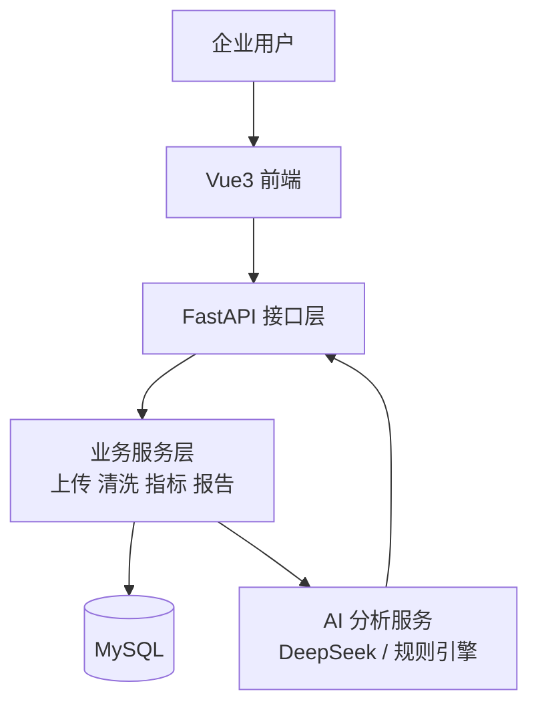

# AI 智能数据分析助手

## 多领域分析编排

### Canonical Field Mapping（内存分析字段映射）

分析链路会先将清洗后的原始字段复制为内存分析副本，再依次执行：

```text
原始字段 → CanonicalFieldMapper → ModuleRegistry → AnalysisPlanner → Analyzer → AI / Report
```

- 当前支持确定性的 Order、StudentScore 与 Inventory 中英文别名：例如 `订单编号 → order_id`、`商品名称 → product`、`学号 → student_id`、`成绩 → score`、`库存数量 → stock_quantity`、`安全库存 → safety_stock`。
- 支持按数据集保存字段映射覆盖（override）：覆盖规则优先级为“用户覆盖 > 自动别名 > 保留原始字段”。覆盖只作用于内存分析副本，不会改写原始上传文件或清洗后的 CSV。
- 可通过 `GET /api/v1/datasets/{id}/field-mapping` 预览当前自动映射与覆盖结果，并使用 `PUT /api/v1/datasets/{id}/field-mapping` 全量保存覆盖。例如：`{"overrides":{"总评":"score","课程名称":"subject"}}`；传入 `{"overrides":{}}` 可清空该数据集的全部覆盖并恢复自动映射。
- 覆盖保存会校验当前最新清洗文件的真实列名、canonical 目标白名单、同目标重复映射和覆盖 canonical 原列等冲突，并在单一数据库事务中完成替换。不同数据集的覆盖彼此隔离。
- 映射仅作用于内存中的 `DataFrame.copy()`；不会改写用户上传文件、原始 CSV 或清洗后的 CSV。
- canonical 字段优先；canonical 与别名并存、或多个别名同时指向同一字段时会记录 `conflicts`，不会静默覆盖或合并数据。
- 未识别字段会保留原名并写入 `unmapped_columns`。
- 目前只使用精确、可预测的 alias 规则（NFKC、大小写、空白、`-` / `_` 标准化），不使用 AI、模糊匹配或 embedding。

清洗后的 `DataFrame` 会先由 `AnalysisEngine` 识别可用字段，再通过 `ModuleRegistry`
选择 `OrderModule`、`StudentScoreModule`、`InventoryModule` 或 `GenericModule`，最后交给
`AnalysisPlanner` 生成当前数据集可执行的 `analysis_plan`。

- `OrderModule` 继续由 `MetricsService` 执行既有订单、销售、区域等真实指标计算；
- `StudentScoreModule` 由 `StudentScoreAnalyzer` 在能力规划通过后计算学生数量、成绩概览、学科/班级/学生聚合与考试趋势；
- `InventoryModule` 由 `InventoryAnalyzer` 在能力规划通过后计算商品数量、库存概览、低库存明细、库存价值及分类/仓库/供应商/流动/趋势汇总；
- `GenericModule` 返回真实的行数、列画像和缺失值统计，不伪造订单或销售数据。

因此，非订单数据会保留既有指标返回字段，但以 `None` 或空列表表达“不适用”，不会把缺失业务指标写成 `0`。

## 当前开发进度

Vue 前端已接入当前数据集的真实 `metrics`、`selected_module` 与字段映射接口：数据驾驶舱会根据 `order`、`student_score`、`inventory`、`generic` 动态展示对应的指标、表格和 ECharts 图表。前端不会将后端的 `null` / 空数组转换为 `0`，未知领域安全回退为通用数据展示。

数据集管理页与分析工作区均提供“字段映射”入口，可查看 automatic、override、unmapped 与 conflict 状态；用户选择受限的 canonical target 后，前端使用 `PUT /api/v1/datasets/{id}/field-mapping` 全量保存 override，并自动重新读取映射和 metrics，因此领域识别和图表无需刷新页面即可更新。“恢复自动映射”会发送空 overrides。当前未实现前端自动字段推荐、模糊匹配、LLM 映射、库存预测或前端自行计算业务指标。

已完成 Analysis Planner 与 MetricsService 的能力驱动指标计算：系统会在清洗后的数据中识别可用字段，返回 `available_fields` 与 `analysis_plan`，并在字段缺失时以 `null` 或空列表表达“当前无法分析”，不会把缺字段误报为数值 `0`。

当不存在 `sales_amount`、但存在有效的 `unit_price` 与 `quantity` 时，系统只在内存分析副本中派生销售额，不会改写已清洗的 CSV 文件。

AI 分析与 Excel、Word、PDF 报告同样基于 `analysis_plan` 动态输出：只描述 Python 已真实计算的指标；缺失字段会进入“本次未分析指标”，不会被解释为数值 `0`。相反，已计算出的销售额总计为 `0` 会被保留并如实展示。DeepSeek 仅接收结构化指标与能力上下文，调用异常时自动降级到同一套规则引擎结论。

学生成绩数据会由 Pandas 计算学生数量、有效成绩数量、平均分、中位数、最高/最低分，以及可用的学科、班级、学生和考试趋势聚合。AI 只解释 `student_score_analysis` 中已计算的真实结果，不假设及格线、不推断及格率/优秀率/GPA，也不重算原始成绩。Excel、Word、PDF 会按真实存在的成绩指标和表格动态输出；本阶段**暂未实现成绩图表**。

库存数据会由 Pandas 计算 `inventory_count`、`stock_summary`、`low_stock_analysis`、`inventory_value`、分类/仓库/供应商库存、库存流动和库存趋势。无效库存、成本、入库或出库值会被忽略，真实库存 `0` 会保留为真实值；低库存只在当前库存与安全库存均可计算时输出。AI 仅解释 `inventory_analysis` 中已计算的结果，不推断库存周转率、采购周期、补货天数、需求预测、缺货概率、EOQ 或 ABC 分类。Excel、Word、PDF 以概览与明细表形式输出库存结果；本阶段**不新增库存图表**。

当前已建立轻量领域模块框架：`ModuleRegistry` 根据 canonical fields 的确定性规则，在 `OrderModule`、`StudentScoreModule`、`InventoryModule` 与 `GenericModule` 中选择模块。学生成绩与库存分析均支持 Python 指标计算、AI 动态解释与 Excel/Word/PDF 动态报告；无效数值会被忽略，真实 `0` 会保留。暂不包含及格率、优秀率、GPA、复杂排名、库存预测、EOQ、ABC 分类、库存周转率或库存图表。通用模块的数值、分类、日期能力暂作为元数据声明，待后续引入字段类型感知后再接入 Planner。

面向企业销售运营场景的全栈数据分析平台。用户上传 Excel/CSV 后，可完成数据解析、清洗、指标分析、可视化、AI 业务洞察与多格式报告导出。

## 项目价值

企业运营数据常分散在表格中，人工清洗和复盘成本高。本项目提供从上传到报告的闭环，帮助运营/销售人员快速识别完成率风险、区域差异和增长趋势，并形成可执行建议。

## 核心功能

- JWT 注册、登录、路由鉴权与 Token 失效处理
- Excel/CSV 上传、字段预览与本机数据集展示记录
- 空行/重复行清理、日期/金额标准化与清洗审计
- 总量、均值、极值、增长率、完成率、区域 TOP 指标
- Vue3 + ECharts 数据驾驶舱
- DeepSeek / 规则引擎 AI 分析：摘要、异常、风险、建议
- Excel、Word、PDF 实时报告导出
- 操作审计日志、Docker Compose 部署与 Swagger 文档

## 技术架构

| 层级 | 技术 |
| --- | --- |
| Frontend | Vue3、Vite、Pinia、Vue Router、Axios、Element Plus、ECharts |
| Backend | Python、FastAPI、SQLAlchemy、Pandas、NumPy、OpenPyXL |
| Database | MySQL 8 |
| AI | DeepSeek API（兼容 OpenAI SDK）+ Prompt Engineering + 规则降级 |
| Deployment | Docker、Docker Compose、Linux |



详细说明见 [架构文档](docs/architecture.md)。

## 页面截图

> 将实际截图放入 `docs/images/` 后替换下列占位路径；请勿提交含业务敏感数据的截图。

| 登录页 | 数据驾驶舱 |
| --- | --- |
| `docs/images/login.png` | `docs/images/dashboard.png` |
| 数据集管理 | AI 分析报告 |
| `docs/images/datasets.png` | `docs/images/ai-analysis.png` |
| 报告下载中心 |  |
| `docs/images/download-center.png` |  |

## 快速启动

### Docker（推荐）

```powershell
cd "D:\开发\python项目\AI智能数据分析助手"
Copy-Item .env.example .env
# 编辑 .env：至少设置 MYSQL_ROOT_PASSWORD；可选配置 DeepSeek
docker compose up --build
```

打开 <http://127.0.0.1:8000/docs>。停止服务：`docker compose down`。

### 本地开发

后端：

```powershell
cd backend
Copy-Item .env.example .env
.\.venv\Scripts\python.exe -m pip install -r requirements.txt
.\.venv\Scripts\python.exe -m uvicorn app.main:app --reload
```

Vue 前端：

```powershell
cd frontend\vue-app
npm install
npm run dev
```

前端默认通过 Vite 配置将 `/api` 代理到 FastAPI。更多见 [部署文档](docs/deployment.md)。

## 常用接口

- `POST /api/v1/auth/register`、`POST /api/v1/auth/login`
- `POST /api/v1/datasets/upload`
- `POST /api/v1/datasets/{id}/clean`
- `GET /api/v1/datasets/{id}/field-mapping`
- `PUT /api/v1/datasets/{id}/field-mapping`
- `GET /api/v1/datasets/{id}/metrics`
- `POST /api/v1/datasets/{id}/ai-analysis`
- `GET /api/v1/datasets/{id}/reports/{excel|word|pdf}`

完整接口清单见 [API 文档](docs/api.md)，数据库说明见 [database.md](docs/database.md)。

## 完整使用流程与演示数据

1. 启动 MySQL 后启动 FastAPI 与 Vue 前端，使用“注册 / 登录”进入工作台。
2. 在“数据集管理”上传 CSV 或 XLSX；空文件、仅表头文件、非 CSV/XLSX 或无法解析的文件会返回明确提示。
3. 对上传结果执行“开始清洗”，随后进入“数据驾驶舱”查看自动领域识别和真实指标。
4. 若自动识别不完整，在“字段映射”中保存用户覆盖；保存后无需刷新浏览器，驾驶舱会重新请求指标并切换领域。
5. 在“AI 分析报告”生成洞察。DeepSeek 不可用时，系统会基于 Python 已计算的指标自动使用规则引擎降级，不影响指标查看与报告导出。
6. 在“报告下载中心”导出 Excel、Word 或 PDF。下载以 HTTP `Content-Disposition` 的文件名为准；HTTP 错误或空文件不会创建损坏下载。

可直接上传以下轻量演示数据：

| 领域 | 文件 | 推荐字段 |
| --- | --- | --- |
| Order | `examples/order_sample.csv` | 订单编号、商品名称、数量、单价、区域、订单日期 |
| StudentScore | `examples/student_score_sample.csv` | 学号、学生姓名、科目、成绩、班级、考试日期 |
| Inventory | `examples/inventory_sample.csv` | 商品编号、商品名称、库存数量、安全库存、单位成本、仓库 |
| Generic | `examples/generic_sample.csv` | 姓名、城市、备注 |

### 指标语义约定

- `null` / `—` 表示当前数据集缺少条件，指标**不可分析或不适用**；它不等于 0。
- `0` 是 Python / Pandas 已真实计算出的数值，前端、AI 与报告会如实保留。
- AI 不负责计算核心指标。订单、成绩、库存与通用分析的数值真值始终由 Python / Pandas 产生；AI 只解释这些结构化结果。
- `Generic` 是预期的通用数据分析回退，而不是“识别失败”；它提供行数、列画像和缺失值统计，不伪造销售、成绩或库存指标。

## 测试与安全

```powershell
cd frontend\vue-app
npm test
npm run build
```

不要提交 `.env`、上传/导出文件、日志、`node_modules` 或任何 API Key。项目展示与面试材料见 [interview.md](docs/interview.md)。
