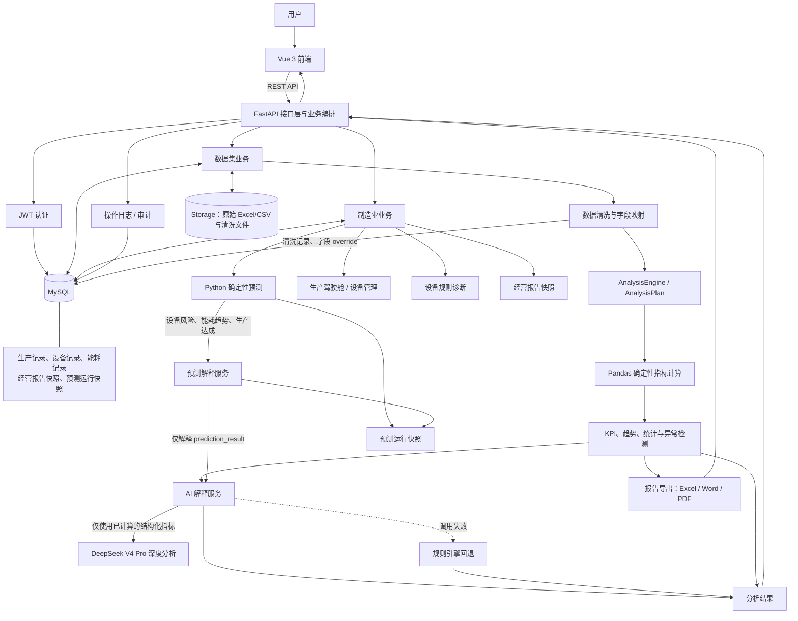

# AI 智能数据分析助手

面向企业运营场景的全栈数据分析平台。上传 CSV/XLSX 后，系统依次完成清洗、字段识别、领域匹配、Pandas 指标计算、AI 解释及 Excel/Word/PDF 报告导出。

## 核心特点

- CSV/XLSX 上传、清洗记录、JWT 鉴权和操作审计
- `CanonicalFieldMapper` 自动字段映射，支持数据集级人工 override
- `AnalysisEngine + AnalysisPlanner` 选择可执行分析能力
- Python / Pandas 计算真实指标；AI 只解释已有结构化结果
- Vue3 动态 Dashboard、字段映射、AI 报告与下载中心
- DeepSeek 可选接入，调用失败自动降级为规则引擎
- 制造业生产经营驾驶舱、设备管理、设备诊断和经营报告快照
- Python 确定性预测：设备风险、能耗趋势、生产达成；AI 仅解释预测结果
- Docker Compose：MySQL、FastAPI、Nginx/Vue

## 技术栈

| 层级 | 技术 |
| --- | --- |
| 前端 | Vue 3、Vite、Pinia、Vue Router、Axios、Element Plus、ECharts |
| 后端 | FastAPI、SQLAlchemy、Pandas、NumPy、OpenPyXL、python-docx、ReportLab |
| 数据库 | MySQL 8 |
| AI | DeepSeek（OpenAI-compatible）+ 规则 fallback |
| 部署 | Docker、Docker Compose、Nginx |

## 系统架构



## 当前支持领域

| 领域 | 输出 |
| --- | --- |
| Order | 订单统计、可信销售额、客单价、商品/品类/地区分析、时间趋势、客户复购、状态/支付/折扣分析与数据质量检查（字段可用时） |
| StudentScore | 学生数、成绩概览、学科/班级/学生聚合、考试趋势（字段可用时） |
| Inventory | 库存概览、低库存、库存价值、分类/仓库/供应商汇总（字段可用时） |
| Generic | 行数、列画像、缺失值分析；是合法 fallback，不是系统错误 |

### 制造业生产经营模块

| 模块 | 数据来源 | 已实现能力 |
| --- | --- | --- |
| 生产经营驾驶舱 | `production_records`、`equipment_records`、`energy_records` | 今日产量、生产达成率、设备运行率、单位能耗、生产/能耗趋势和设备状态图表 |
| 设备管理 | `equipment_records` | 设备列表、详情、温度/振动历史趋势、基于阈值的异常提示 |
| AI 设备诊断 | 最新设备运行与异常规则结果 | 风险等级、问题分析、可能原因和处理建议；复用统一 AI 调用与规则降级 |
| AI 经营报告中心 | 生产、设备、能耗记录及诊断结果 | 生产/设备/能耗确定性指标、AI 总结、报告历史，以及 Excel/Word/PDF 快照导出 |
| 预测与预警 | 三类制造业历史记录 | 设备故障风险、能耗趋势、生产达成预测、风险统计、趋势图与预测历史 |

#### 制造业预测职责边界

- `EquipmentFailurePredictor` 依据温度、振动、故障次数和设备状态输出确定性设备风险。
- `EnergyConsumptionPredictor` 使用移动平均和趋势斜率预测单位能耗趋势与预警等级。
- `ProductionCompletionPredictor` 依据水泥实际产量与计划产量重新计算完成率，并判断生产达成趋势。
- 所有预测数值、趋势和风险等级均由 Python 产生并保存为 `manufacturing_prediction_runs` 快照；AI 不重算、不覆盖风险等级，也不新增数值、传感器数据或故障记录。
- `PredictionExplanationService` 仅向统一的 `AIAnalysisService` 提交 `prediction_result`、已确定风险等级与规则原因，返回 AI 总结、风险解释与建议；DeepSeek 不可用时自动回退规则解释。

`null` / `—` 表示不可分析或不适用，**不等于 0**；真实计算值为 `0` 会原样保留。Python / Pandas 是指标真值来源，AI 不计算或编造核心指标。

### 订单分析口径

- 支持确定性字段映射：`user_id → customer_id`、`user_name → customer_name`、`city → region`、`order_time → date`、`order_amount → sales_amount`，以及分类、折扣、支付方式、性别、年龄等常见订单字段。
- 销售统计使用可信金额：行内 `unit_price`、`quantity`、`discount` 都有效时优先计算 `unit_price × quantity × discount`；整个数据集没有折扣列时按 `unit_price × quantity`；无法计算但 `order_amount` 有效时才使用该原始金额。两者同时存在且不一致会被记录，不会静默覆盖。
- `record_count` 是实际记录行数，`order_count` 优先按非空 `order_id` 去重；完整重复行、重复订单号、非法日期/价格/数量/折扣/年龄/状态和金额不一致均在数据质量结果中说明。
- AI 只读取 Pandas 已计算的聚合结果，不接收原始整表、手机号、邮箱或备注；它负责解释、风险提示和建议，不重算销售额或编造业务指标。

## 快速开始

### 数据库与后端

先创建空数据库，例如：

```sql
CREATE DATABASE ai_data_analysis DEFAULT CHARACTER SET utf8mb4;
```

复制 `backend/.env.example` 为 `backend/.env`，填写 MySQL 连接、JWT 随机密钥和可选 LLM 配置：

```powershell
cd backend
python -m venv .venv
.\.venv\Scripts\Activate.ps1
python -m pip install -r requirements.txt
uvicorn app.main:app --reload
```

Swagger：<http://127.0.0.1:8000/docs>

首次启动会由 SQLAlchemy `Base.metadata.create_all()` 创建当前模型表。已有 MySQL 数据库可按顺序执行 `backend/sql/001_create_users_table.sql` 至 `backend/sql/009_create_manufacturing_prediction_runs.sql`；项目未使用 Alembic。

其中 `006` 创建制造业生产/设备/能耗表，`007` 写入演示数据，`008` 创建制造业经营报告快照表，`009` 创建制造业预测运行快照表。生产数据库执行 `007` 前请确认需要演示数据。

`STORAGE_ROOT` 对应的上传和清洗目录会由应用运行时创建；运行数据不应提交到 Git。

### 前端

```powershell
cd frontend/vue-app
Copy-Item .env.example .env.local
npm install
npm run dev
```

默认地址：<http://127.0.0.1:5173>。Axios 仅从 `VITE_API_BASE_URL` 读取 API 地址；留空时 Vite 的 `/api` 代理使用 `VITE_API_PROXY_TARGET`（默认 `http://127.0.0.1:8000`）。

### Docker Compose

```powershell
Copy-Item .env.example .env
# 编辑 .env：替换 MYSQL_ROOT_PASSWORD、JWT_SECRET_KEY；如使用 DeepSeek 再替换 LLM_API_KEY
docker compose config
# 首次启动：前台构建并启动，便于查看 MySQL 初始化和服务日志
docker compose up --build
```

首次启动成功后，可按 `Ctrl+C` 停止前台进程，再使用后台模式：

```powershell
docker compose up -d
docker compose ps
```

访问地址：

- 前端：<http://localhost>
- 后端：<http://localhost:8000>
- Swagger：<http://localhost:8000/docs>

停止服务但保留数据库数据：

```powershell
docker compose down
```

MySQL 在**首次创建空的 `mysql_data` volume** 时，会按文件名顺序执行 `backend/sql/001` 至 `008`：创建用户、数据集、清洗记录、审计日志、字段映射、制造业表、演示数据和经营报告表。已有 volume 不会重复执行这些 SQL；不要随意执行 `docker compose down -v`，否则会删除本地数据库数据。

## 环境变量

根目录 `.env.example` 仅供 Docker Compose：

| 变量 | 用途 |
| --- | --- |
| `MYSQL_ROOT_PASSWORD` | MySQL root 密码，同时传给后端 |
| `JWT_SECRET_KEY` | JWT 签名密钥，生产环境使用至少 32 位随机值 |
| `MYSQL_DATABASE`、`MYSQL_PORT` | Compose 数据库名和端口 |
| `FRONTEND_PORT`、`BACKEND_PORT` | Nginx 与 FastAPI 主机端口 |
| `CORS_ALLOWED_ORIGINS` | 允许凭据访问的浏览器 Origin 白名单 |
| `LLM_PROVIDER`、`LLM_API_KEY`、`LLM_BASE_URL`、`LLM_MODEL`、`LLM_TIMEOUT_SECONDS` | 可选大模型配置；DeepSeek 思考模式示例使用 `deepseek-v4-pro`，默认 25 秒超时且不自动重试，失败时降级规则分析 |

`backend/.env.example` 用于本地后端，包含 MySQL、存储、上传大小、JWT 和 LLM 变量。`frontend/vue-app/.env.example` 用于前端 API 地址和 Vite 代理。所有 `.env` 文件均被 Git 忽略。

## 使用流程

通用数据分析流程：注册 / 登录 → 上传 CSV/XLSX → 清洗 → 自动映射与领域识别 → 必要时人工 override → 动态 Dashboard → AI 分析 → 导出 Excel/Word/PDF。

制造业流程：登录 → 生产经营驾驶舱 → 设备管理与异常诊断 → 生成经营报告快照或预测快照 → 查看 Python 指标/预测趋势 → 查看 AI 解释或规则降级解释。

制造业预测页面入口：<http://127.0.0.1:5173/manufacturing/prediction>。预测详情中的 AI 解释来自已保存快照；历史快照没有解释字段时前端会显示空状态，但预测结果与图表仍可正常查看。

字段 override 使用 `PUT /api/v1/datasets/{id}/field-mapping` 全量替换：

```json
{"overrides": {"学生编号": "student_id", "课程名": "subject", "总评": "score"}}
```

`{"overrides": {}}` 可恢复自动映射。覆盖优先级为用户 override > 自动 alias > 原始字段，且只作用于内存分析副本，不改写原始或清洗文件。

## 示例数据

`examples/` 中四份 UTF-8、无隐私 CSV 可直接上传：

- `order_sample.csv`：订单编号、商品名称、数量、单价、区域、订单日期
- `student_score_sample.csv`：学号、学生姓名、科目、成绩、班级、考试日期
- `inventory_sample.csv`：商品编号、商品名称、库存数量、安全库存、单位成本、仓库
- `generic_sample.csv`：姓名、城市、备注

## API、CORS 与目录

FastAPI 内置 Swagger，开发环境访问 `/docs`。主要接口类别为认证、数据集、字段映射、指标、AI、报告、审计日志，以及制造业生产/设备/诊断/经营报告/预测。

CORS 使用 `CORS_ALLOWED_ORIGINS` 白名单并允许凭据，不使用 `*`。Docker Nginx 将 `/api/` 代理至 FastAPI。Docker 的 `./storage` 挂载到后端 `/storage`，用于上传与清洗结果。

## 测试

```powershell
cd backend
python -m pytest tests -q

cd ../frontend/vue-app
npm run test
npm run build
```

项目没有独立 lint 脚本。不要提交 `.env`、密钥、上传/清洗/报告文件、日志、虚拟环境、`node_modules`、`dist` 或 `coverage`。

## 项目目录

```text
backend/                 FastAPI、通用与制造业领域服务、预测器、SQL 补丁、测试
frontend/vue-app/        Vue 3 前端
examples/                可直接演示的 CSV
storage/                 运行数据（忽略实际内容）
docs/                    架构、数据库、部署说明
docker-compose.yml       MySQL + Backend + Nginx
```

## 已知限制

- 暂不支持 fuzzy/embedding/LLM 自动字段映射。
- 暂不支持库存预测、EOQ、ABC 分类、学生 GPA、自动业务规则推断或更多领域。
- 制造业预测采用可解释的移动平均、简单趋势和阈值规则，不包含在线训练、深度学习或复杂机器学习模型。
- AI 不重算指标；外部模型失败时返回规则解释。
- Compose 适合单机演示；真实生产仍需 HTTPS、备份、日志轮转和专用密钥管理。

## 安全说明

不要提交 API Key、数据库密码、JWT 密钥、个人 Token、上传文件或报告。仓库中的示例数据均为虚构演示数据。
