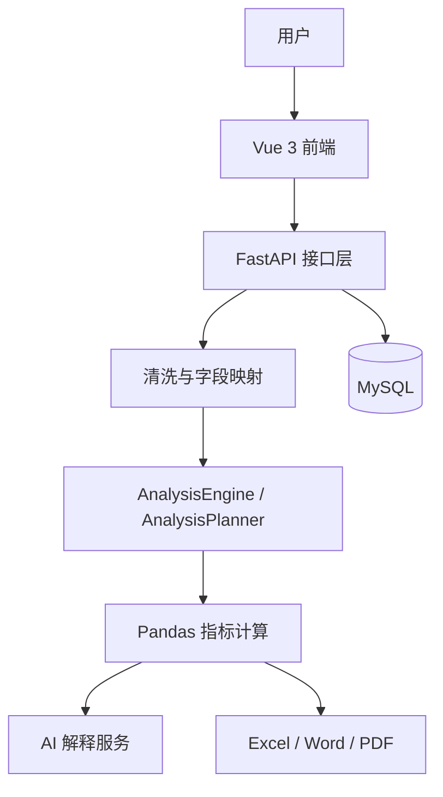

# AI 智能数据分析助手

面向企业运营场景的全栈数据分析平台。上传 CSV/XLSX 后，系统依次完成清洗、字段识别、领域匹配、Pandas 指标计算、AI 解释及 Excel/Word/PDF 报告导出。

## 核心特点

- CSV/XLSX 上传、清洗记录、JWT 鉴权和操作审计
- `CanonicalFieldMapper` 自动字段映射，支持数据集级人工 override
- `AnalysisEngine + AnalysisPlanner` 选择可执行分析能力
- Python / Pandas 计算真实指标；AI 只解释已有结构化结果
- Vue3 动态 Dashboard、字段映射、AI 报告与下载中心
- DeepSeek 可选接入，调用失败自动降级为规则引擎
- Docker Compose：MySQL、FastAPI、Nginx/Vue

## 技术栈

| 层级 | 技术 |
| --- | --- |
| 前端 | Vue 3、Vite、Pinia、Vue Router、Axios、Element Plus、ECharts |
| 后端 | FastAPI、SQLAlchemy、Pandas、NumPy、OpenPyXL、python-docx、ReportLab |
| 数据库 | MySQL 8 |
| AI | DeepSeek（OpenAI-compatible）+ 规则 fallback |
| 部署 | Docker、Docker Compose、Nginx |

## 系统架构



## 当前支持领域

| 领域 | 输出 |
| --- | --- |
| Order | 订单数、销售额、商品销量、区域排行、趋势与完成率（字段可用时） |
| StudentScore | 学生数、成绩概览、学科/班级/学生聚合、考试趋势（字段可用时） |
| Inventory | 库存概览、低库存、库存价值、分类/仓库/供应商汇总（字段可用时） |
| Generic | 行数、列画像、缺失值分析；是合法 fallback，不是系统错误 |

`null` / `—` 表示不可分析或不适用，**不等于 0**；真实计算值为 `0` 会原样保留。Python / Pandas 是指标真值来源，AI 不计算或编造核心指标。

## 快速开始

### 数据库与后端

先创建空数据库，例如：

```sql
CREATE DATABASE ai_data_analysis DEFAULT CHARACTER SET utf8mb4;
```

复制 `backend/.env.example` 为 `backend/.env`，填写 MySQL 连接、JWT 随机密钥和可选 LLM 配置：

```powershell
cd backend
python -m venv .venv
.\.venv\Scripts\Activate.ps1
python -m pip install -r requirements.txt
uvicorn app.main:app --reload
```

Swagger：<http://127.0.0.1:8000/docs>

首次启动会由 SQLAlchemy `Base.metadata.create_all()` 创建当前模型表。已有 MySQL 数据库可按顺序执行 `backend/sql/001_create_users_table.sql` 至 `backend/sql/005_create_dataset_field_mapping_overrides.sql`；项目未使用 Alembic，`005` 用于字段 override 表。

`STORAGE_ROOT` 对应的上传和清洗目录会由应用运行时创建；运行数据不应提交到 Git。

### 前端

```powershell
cd frontend/vue-app
Copy-Item .env.example .env.local
npm install
npm run dev
```

默认地址：<http://127.0.0.1:5173>。Axios 仅从 `VITE_API_BASE_URL` 读取 API 地址；留空时 Vite 的 `/api` 代理使用 `VITE_API_PROXY_TARGET`（默认 `http://127.0.0.1:8000`）。

### Docker Compose

```powershell
Copy-Item .env.example .env
# 编辑 .env：设置 MYSQL_ROOT_PASSWORD 和 JWT_SECRET_KEY
docker compose config
docker compose up --build -d
```

默认入口：前端 <http://localhost/>，Swagger <http://localhost:8001/docs>，MySQL 主机端口 `3308`。使用 `docker compose down` 停止并保留数据；不要随意执行 `docker compose down -v`。

## 环境变量

根目录 `.env.example` 仅供 Docker Compose：

| 变量 | 用途 |
| --- | --- |
| `MYSQL_ROOT_PASSWORD` | MySQL root 密码，同时传给后端 |
| `JWT_SECRET_KEY` | JWT 签名密钥，生产环境使用至少 32 位随机值 |
| `MYSQL_DATABASE`、`MYSQL_PORT` | Compose 数据库名和端口 |
| `FRONTEND_PORT`、`BACKEND_PORT` | Nginx 与 FastAPI 主机端口 |
| `CORS_ALLOWED_ORIGINS` | 允许凭据访问的浏览器 Origin 白名单 |
| `LLM_PROVIDER`、`LLM_API_KEY`、`LLM_BASE_URL`、`LLM_MODEL` | 可选大模型配置 |

`backend/.env.example` 用于本地后端，包含 MySQL、存储、上传大小、JWT 和 LLM 变量。`frontend/vue-app/.env.example` 用于前端 API 地址和 Vite 代理。所有 `.env` 文件均被 Git 忽略。

## 使用流程

注册 / 登录 → 上传 CSV/XLSX → 清洗 → 自动映射与领域识别 → 必要时人工 override → 动态 Dashboard → AI 分析 → 导出 Excel/Word/PDF。

字段 override 使用 `PUT /api/v1/datasets/{id}/field-mapping` 全量替换：

```json
{"overrides": {"学生编号": "student_id", "课程名": "subject", "总评": "score"}}
```

`{"overrides": {}}` 可恢复自动映射。覆盖优先级为用户 override > 自动 alias > 原始字段，且只作用于内存分析副本，不改写原始或清洗文件。

## 示例数据

`examples/` 中四份 UTF-8、无隐私 CSV 可直接上传：

- `order_sample.csv`：订单编号、商品名称、数量、单价、区域、订单日期
- `student_score_sample.csv`：学号、学生姓名、科目、成绩、班级、考试日期
- `inventory_sample.csv`：商品编号、商品名称、库存数量、安全库存、单位成本、仓库
- `generic_sample.csv`：姓名、城市、备注

## API、CORS 与目录

FastAPI 内置 Swagger，开发环境访问 `/docs`。主要接口类别为认证、数据集、字段映射、指标、AI、报告与审计日志。

CORS 使用 `CORS_ALLOWED_ORIGINS` 白名单并允许凭据，不使用 `*`。Docker Nginx 将 `/api/` 代理至 FastAPI。Docker 的 `./storage` 挂载到后端 `/storage`，用于上传与清洗结果。

## 测试

```powershell
cd backend
python -m pytest tests -q

cd ../frontend/vue-app
npm run test
npm run build
```

项目没有独立 lint 脚本。不要提交 `.env`、密钥、上传/清洗/报告文件、日志、虚拟环境、`node_modules`、`dist` 或 `coverage`。

## 项目目录

```text
backend/                 FastAPI、领域服务、SQL 补丁、测试
frontend/vue-app/        Vue 3 前端
examples/                可直接演示的 CSV
storage/                 运行数据（忽略实际内容）
docs/                    架构、数据库、部署说明
docker-compose.yml       MySQL + Backend + Nginx
```

## 已知限制

- 暂不支持 fuzzy/embedding/LLM 自动字段映射。
- 暂不支持库存预测、EOQ、ABC 分类、学生 GPA、自动业务规则推断或更多领域。
- AI 不重算指标；外部模型失败时返回规则解释。
- Compose 适合单机演示；真实生产仍需 HTTPS、备份、日志轮转和专用密钥管理。

## 安全说明

不要提交 API Key、数据库密码、JWT 密钥、个人 Token、上传文件或报告。仓库中的示例数据均为虚构演示数据。
