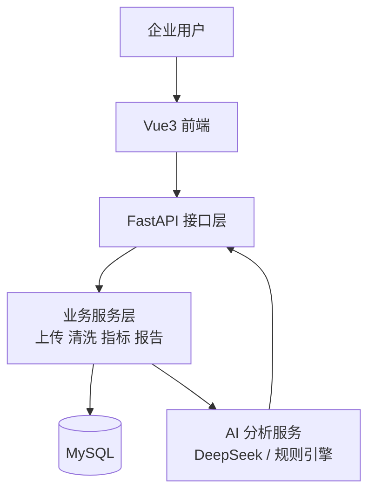

# AI 智能数据分析助手

## 多领域分析编排

清洗后的 `DataFrame` 会先由 `AnalysisEngine` 识别可用字段，再通过 `ModuleRegistry`
选择 `OrderModule`、`StudentScoreModule` 或 `GenericModule`，最后交给
`AnalysisPlanner` 生成当前数据集可执行的 `analysis_plan`。

- `OrderModule` 继续由 `MetricsService` 执行既有订单、销售、区域等真实指标计算；
- `StudentScoreModule` 由 `StudentScoreAnalyzer` 在能力规划通过后计算学生数量、成绩概览、学科/班级/学生聚合与考试趋势；
- `GenericModule` 返回真实的行数、列画像和缺失值统计，不伪造订单或销售数据。

因此，非订单数据会保留既有指标返回字段，但以 `None` 或空列表表达“不适用”，不会把缺失业务指标写成 `0`。

## 当前开发进度

已完成 Analysis Planner 与 MetricsService 的能力驱动指标计算：系统会在清洗后的数据中识别可用字段，返回 `available_fields` 与 `analysis_plan`，并在字段缺失时以 `null` 或空列表表达“当前无法分析”，不会把缺字段误报为数值 `0`。

当不存在 `sales_amount`、但存在有效的 `unit_price` 与 `quantity` 时，系统只在内存分析副本中派生销售额，不会改写已清洗的 CSV 文件。

AI 分析与 Excel、Word、PDF 报告同样基于 `analysis_plan` 动态输出：只描述 Python 已真实计算的指标；缺失字段会进入“本次未分析指标”，不会被解释为数值 `0`。相反，已计算出的销售额总计为 `0` 会被保留并如实展示。DeepSeek 仅接收结构化指标与能力上下文，调用异常时自动降级到同一套规则引擎结论。

当前已建立轻量领域模块框架：`ModuleRegistry` 根据 canonical fields 的确定性规则，在 `OrderModule`、`StudentScoreModule` 与 `GenericModule` 中选择模块。学生成绩分析仅计算 Python 可验证的学生数量、真实有效分数统计、学科/班级/学生聚合和按考试日期或名称的趋势；无效成绩会被忽略，真实 0 分会保留。暂不包含及格率、排名、GPA、AI 成绩解读或中文字段映射。通用模块的数值、分类、日期能力暂作为元数据声明，待后续引入字段类型感知后再接入 Planner。

面向企业销售运营场景的全栈数据分析平台。用户上传 Excel/CSV 后，可完成数据解析、清洗、指标分析、可视化、AI 业务洞察与多格式报告导出。

## 项目价值

企业运营数据常分散在表格中，人工清洗和复盘成本高。本项目提供从上传到报告的闭环，帮助运营/销售人员快速识别完成率风险、区域差异和增长趋势，并形成可执行建议。

## 核心功能

- JWT 注册、登录、路由鉴权与 Token 失效处理
- Excel/CSV 上传、字段预览与本机数据集展示记录
- 空行/重复行清理、日期/金额标准化与清洗审计
- 总量、均值、极值、增长率、完成率、区域 TOP 指标
- Vue3 + ECharts 数据驾驶舱
- DeepSeek / 规则引擎 AI 分析：摘要、异常、风险、建议
- Excel、Word、PDF 实时报告导出
- 操作审计日志、Docker Compose 部署与 Swagger 文档

## 技术架构

| 层级 | 技术 |
| --- | --- |
| Frontend | Vue3、Vite、Pinia、Vue Router、Axios、Element Plus、ECharts |
| Backend | Python、FastAPI、SQLAlchemy、Pandas、NumPy、OpenPyXL |
| Database | MySQL 8 |
| AI | DeepSeek API（兼容 OpenAI SDK）+ Prompt Engineering + 规则降级 |
| Deployment | Docker、Docker Compose、Linux |



详细说明见 [架构文档](docs/architecture.md)。

## 页面截图

> 将实际截图放入 `docs/images/` 后替换下列占位路径；请勿提交含业务敏感数据的截图。

| 登录页 | 数据驾驶舱 |
| --- | --- |
| `docs/images/login.png` | `docs/images/dashboard.png` |
| 数据集管理 | AI 分析报告 |
| `docs/images/datasets.png` | `docs/images/ai-analysis.png` |
| 报告下载中心 |  |
| `docs/images/download-center.png` |  |

## 快速启动

### Docker（推荐）

```powershell
cd "D:\开发\python项目\AI智能数据分析助手"
Copy-Item .env.example .env
# 编辑 .env：至少设置 MYSQL_ROOT_PASSWORD；可选配置 DeepSeek
docker compose up --build
```

打开 <http://127.0.0.1:8000/docs>。停止服务：`docker compose down`。

### 本地开发

后端：

```powershell
cd backend
Copy-Item .env.example .env
.\.venv\Scripts\python.exe -m pip install -r requirements.txt
.\.venv\Scripts\python.exe -m uvicorn app.main:app --reload
```

Vue 前端：

```powershell
cd frontend\vue-app
npm install
npm run dev
```

前端默认通过 Vite 配置将 `/api` 代理到 FastAPI。更多见 [部署文档](docs/deployment.md)。

## 常用接口

- `POST /api/v1/auth/register`、`POST /api/v1/auth/login`
- `POST /api/v1/datasets/upload`
- `POST /api/v1/datasets/{id}/clean`
- `GET /api/v1/datasets/{id}/metrics`
- `POST /api/v1/datasets/{id}/ai-analysis`
- `GET /api/v1/datasets/{id}/reports/{excel|word|pdf}`

完整接口清单见 [API 文档](docs/api.md)，数据库说明见 [database.md](docs/database.md)。

## 测试与安全

```powershell
cd frontend\vue-app
npm test
npm run build
```

不要提交 `.env`、上传/导出文件、日志、`node_modules` 或任何 API Key。项目展示与面试材料见 [interview.md](docs/interview.md)。
