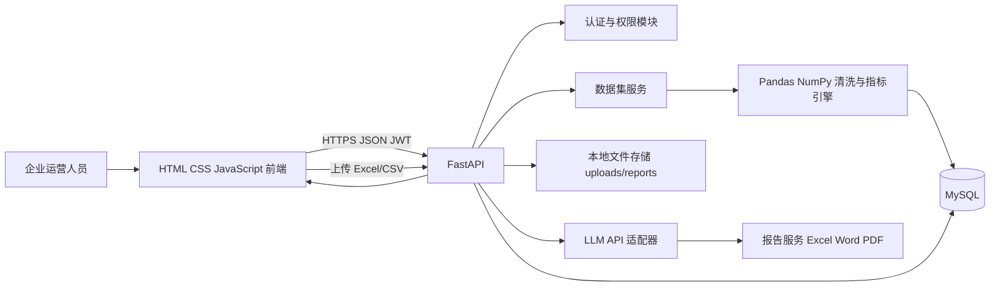

# AI 智能数据分析助手：第一阶段设计

## 1. 项目定位与 MVP 边界

本项目面向企业运营人员，将 Excel/CSV 销售业务数据转化为可追溯的数据分析结果：上传、校验、清洗、指标计算、ECharts 可视化、AI 分析报告和多格式导出。

第一版以销售运营数据为标准数据集，支持以下核心字段：`date`（日期）、`region`（区域）、`product`（产品）、`sales_amount`（销售额）、`target_amount`（目标额）和 `customer_count`（客户数）。导入时支持中文列名映射，例如“日期”“区域”“产品”“销售额”“目标额”“客户数”。其他业务数据可保存，但不承诺自动计算销售专属指标。

MVP 必做闭环：注册登录 -> 上传文件 -> 字段预览与确认 -> 数据清洗 -> 计算指标 -> 仪表盘 -> AI 建议 -> 下载报告。权限、操作日志、缓存、Swagger 和 Docker 纳入交付范围；团队、审批流、实时流数据、自动训练模型不属于第一版。

## 2. 用户、权限与关键流程

| 角色 | 权限 |
| --- | --- |
| `USER` | 管理自己的数据集、查看自己的分析、生成和下载自己的报告 |
| `ADMIN` | 查看全部数据集、管理用户、查看操作日志 |

关键数据流：浏览器上传文件 -> FastAPI 校验文件类型/大小并落盘 -> Pandas 解析与字段映射 -> 清洗结果和统计摘要写入 MySQL -> 前端请求分析接口 -> ECharts 绘图 -> 后端将受控摘要和异常信息发送至 LLM -> 保存 AI 报告 -> 按需生成 Excel/Word/PDF。

所有资源接口均从 JWT 中读取当前用户；不能相信请求体中的 `user_id`、`role` 或资源归属。数据集、分析报告、导出文件均需后端校验归属或管理员权限。

## 3. 系统架构



采用单体分层架构，而不是微服务：本科生项目可完整交付、方便本地调试和 Docker 部署；服务边界明确，后期可将 AI、异步任务或文件存储独立拆分。前端使用原生三件套和 ECharts，部署简单且能清晰展示接口、鉴权和可视化能力。

## 4. 前端信息架构

默认采用浅色“经营分析工作台”，融入深色方案的经营健康度、风险预警和行动建议。页面必须提供 loading、空数据和错误状态。

| 页面 | 路由 | 目标 |
| --- | --- | --- |
| 登录/注册 | `login.html`、`register.html` | 获取 JWT，表单校验与友好错误提示 |
| 经营分析工作台 | `index.html` | KPI、趋势、产品贡献、TOP 5、AI 总结、健康度 |
| 数据集管理 | `datasets.html` | 上传、字段预览、清洗状态、失败原因、删除确认 |
| 数据集详情 | `dataset-detail.html?id=` | 原始/清洗摘要、异常记录、指标和图表 |
| AI 洞察 | `insights.html?id=` | 数据摘要、风险项、业务问题、建议与报告生成 |
| 报告中心 | `reports.html` | 查看报告状态和下载 Excel/Word/PDF |
| 管理后台 | `admin.html` | 用户、数据集概况与操作日志，仅管理员可见 |

前端使用统一的 `api.js` 处理 Token、请求错误和 401 跳转；页面不直接拼接接口地址。图表数据由后端返回标准结构，避免把业务计算放到浏览器。

## 5. 数据库设计

### 5.1 表清单

| 表名 | 用途 | 关键字段 |
| --- | --- | --- |
| `users` | 用户与角色 | `id`、`username`、`email`、`password_hash`、`role`、`status`、`created_at` |
| `datasets` | 上传文件和处理状态 | `id`、`owner_id`、`name`、`original_filename`、`storage_path`、`file_type`、`file_size`、`status`、`row_count`、`clean_row_count`、`schema_json`、`error_message` |
| `dataset_columns` | 解析后的字段与映射 | `id`、`dataset_id`、`source_name`、`standard_name`、`data_type`、`is_required`、`position` |
| `dataset_records` | 清洗后的标准化销售记录 | `id`、`dataset_id`、`biz_date`、`region`、`product`、`sales_amount`、`target_amount`、`customer_count`、`raw_json` |
| `analysis_runs` | 每次计算的可追溯快照 | `id`、`dataset_id`、`triggered_by`、`status`、`summary_json`、`metrics_json`、`chart_json`、`error_message`、`created_at` |
| `ai_reports` | LLM 输出与提示词版本 | `id`、`analysis_run_id`、`provider`、`model_name`、`prompt_version`、`report_json`、`status`、`error_message` |
| `generated_reports` | 导出文件元数据 | `id`、`analysis_run_id`、`ai_report_id`、`format`、`storage_path`、`status`、`created_at` |
| `operation_logs` | 安全与审计日志 | `id`、`user_id`、`action`、`resource_type`、`resource_id`、`ip_address`、`detail_json`、`created_at` |

### 5.2 约束与状态

- `users.username`、`users.email` 必须唯一；密码仅保存 BCrypt 哈希。
- 所有外键使用真实外键或在 ORM 中配置一致的级联策略；用户删除第一版不开放。
- `datasets.status`：`UPLOADED`、`PARSING`、`CLEANED`、`ANALYZED`、`FAILED`。
- `analysis_runs.status`：`PENDING`、`RUNNING`、`SUCCEEDED`、`FAILED`。
- `generated_reports.format`：`XLSX`、`DOCX`、`PDF`；状态：`PENDING`、`SUCCEEDED`、`FAILED`。
- 数据库金额使用 `DECIMAL(18,2)`；日期使用 `DATE`；创建/更新时间统一 UTC 时间戳。
- 为 `datasets.owner_id`、`dataset_records.dataset_id + biz_date`、`analysis_runs.dataset_id`、`operation_logs.user_id + created_at` 建立索引。

## 6. 后端模块与接口契约

后端采用 `Controller(API) -> Service -> Repository/SQLAlchemy Model` 分层。Controller 只负责参数校验、鉴权和统一响应；Pydantic DTO/VO 处理输入输出。

| 模块 | 核心接口 |
| --- | --- |
| 认证 | `POST /api/v1/auth/register`、`POST /api/v1/auth/login`、`GET /api/v1/auth/me` |
| 数据集 | `POST /api/v1/datasets`、`GET /api/v1/datasets`、`GET /api/v1/datasets/{id}`、`DELETE /api/v1/datasets/{id}` |
| 分析 | `POST /api/v1/datasets/{id}/analyze`、`GET /api/v1/analysis-runs/{id}`、`GET /api/v1/datasets/{id}/dashboard` |
| AI | `POST /api/v1/analysis-runs/{id}/ai-report`、`GET /api/v1/ai-reports/{id}` |
| 报告 | `POST /api/v1/analysis-runs/{id}/exports`、`GET /api/v1/generated-reports/{id}/download` |
| 管理 | `GET /api/v1/admin/users`、`GET /api/v1/admin/operation-logs` |

统一响应：`{ "code": 0, "message": "success", "data": {} }`；参数错误、未登录、无权限、资源不存在和处理失败使用全局异常处理映射为一致 JSON。Swagger 在 `/docs` 提供。

## 7. 数据处理和指标规则

清洗顺序：文件类型/大小校验 -> 编码与工作表识别 -> 标准字段映射 -> 日期、金额、整数类型转换 -> 去除全空行 -> 必填字段缺失处理 -> 金额负数与异常值标记 -> 重复记录检查 -> 输出清洗摘要。

| 指标 | 规则 |
| --- | --- |
| 总数据量 | 清洗后有效记录数 |
| 销售总额 | `sum(sales_amount)` |
| 平均值 | `mean(sales_amount)` |
| 最大/最小值 | `max/min(sales_amount)` |
| 完成率 | `sum(sales_amount) / sum(target_amount) * 100%`，目标额为 0 时显示 `N/A` |
| 增长率 | `(本期销售额 - 上期销售额) / 上期销售额 * 100%`，上期为 0 时显示 `N/A` |
| TOP 排名 | 按销售额降序聚合区域或产品；相同值采用并列名次 |

所有图表和 AI 输入均基于同一次 `analysis_run` 快照，以保证页面、报告和导出结果一致。

## 8. AI 分析设计

AI 服务不直接读取原始 Excel，而是接收受控统计摘要：数据范围、核心指标、趋势、区域/产品排名、异常项和清洗说明。提示词要求模型输出 JSON：`summary`、`anomalies`、`business_issues`、`recommendations`、`report_markdown`。后端验证 JSON，验证失败时保存原始文本并返回可读错误，不让页面白屏。

密钥只放在 `.env`，通过环境变量读取；日志和响应不输出 API Key。模型调用失败时，仪表盘仍可用，并提示“AI 报告暂不可用，可稍后重试”。LangChain 作为可选适配层，第一版优先使用官方 SDK 封装，避免为简单链路引入不必要复杂度。

## 9. 项目目录

```text
AI智能数据分析助手/
├─ backend/
│  ├─ app/
│  │  ├─ api/v1/          # 路由与 Controller
│  │  ├─ core/            # 配置、安全、异常、日志
│  │  ├─ db/              # 会话和初始化
│  │  ├─ models/          # SQLAlchemy 模型
│  │  ├─ schemas/         # Pydantic DTO/VO
│  │  ├─ services/        # 认证、数据集、分析、AI、报告
│  │  ├─ repositories/    # 数据访问
│  │  ├─ processors/      # Pandas 清洗、指标、图表数据
│  │  └─ main.py
│  ├─ alembic/            # MySQL 迁移
│  ├─ tests/
│  ├─ requirements.txt
│  └─ Dockerfile
├─ frontend/
│  ├─ pages/
│  ├─ assets/css/
│  ├─ assets/js/          # api.js、auth.js、charts.js
│  └─ assets/vendor/      # ECharts 本地依赖或 CDN 说明
├─ docs/design/
├─ sql/                   # 初始化与升级 SQL 补丁
├─ storage/uploads/.gitkeep
├─ storage/reports/.gitkeep
├─ docker-compose.yml
├─ .env.example
├─ .gitignore
└─ README.md
```

## 10. 开发路线与验收点

1. 初始化工程、虚拟环境、FastAPI 健康检查、MySQL 和 `.env.example`。
2. 用户表迁移、注册登录、JWT 与角色依赖，完成接口测试。
3. 数据集表和安全上传，完成 CSV/XLSX 解析预览与失败提示。
4. 标准字段映射和清洗引擎，添加正常、缺字段、脏数据测试样例。
5. 指标计算与分析快照，完成完成率、增长率、TOP 排名测试。
6. 实现选定的浅色经营分析工作台和 ECharts 图表。
7. AI 适配器、受控 Prompt、报告 JSON 校验与失败降级。
8. Excel、Word、PDF 报告导出，包含数据概览、图表、AI 建议。
9. 管理权限、操作日志、缓存、全局异常与 Swagger 整理。
10. Docker Compose、Linux 部署文档、README、测试和 GitHub 发布。

每一阶段均先运行聚焦测试；前端阶段额外检查浏览器 Console 和 Network，后端阶段运行 `pytest`，交付前运行 Docker 构建、接口冒烟测试和 `git diff --check`。

## 11. 当前决策

- 技术栈：严格使用 Python + FastAPI + MySQL + SQLAlchemy + Pandas/NumPy/OpenPyXL + HTML/CSS/JavaScript + ECharts + LLM API + Docker。
- 视觉：浅色经营分析工作台为主，健康度仪表盘、风险预警和 AI 行动建议为重点模块。
- 默认业务：销售运营数据；接口和存储为后续多数据类型扩展预留。
- 开发策略：单体分层、MVP 先闭环、每个阶段单独验证并提交。
